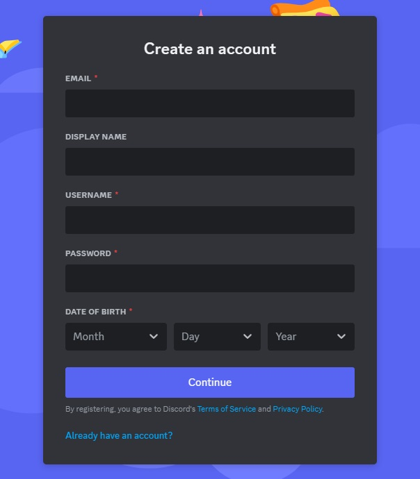
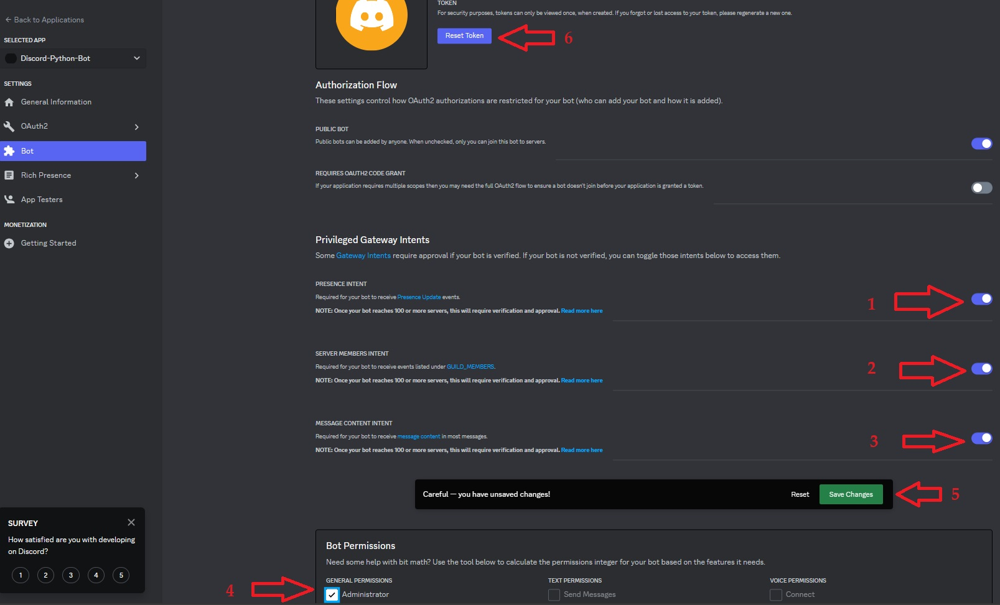
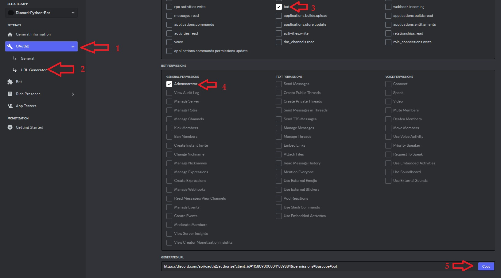

<base target="_blank">

# Discord-Bot-JavaScript
 Basic Discord bot written in JavaScript
* Make Discord account if you don't have one already.
<!-- links -->
>> [Discord - Register a new account](https://discord.com/register)
<!--Images-->

* Goto to the Discord Developer Portal and click ***New Application***
<!-- links -->
>> [Discord - Developer Portal](https://discord.com/developers/applications)
<!--Images-->

* NAME your bot, Check the box and click ***Create***
<!--Images-->

* Click ***Bot*** on the left
<!--Ordered List -->
>>1. PRESENCE INTENT (toggle on)
>>2. SERVERS MEMBERS INTENT (toggle on)
>>3. MESSAGE CONTENT INTENT (toggle on)
>>4. Administrator (check box)
>>5. Save Changes
>>6. Reset Token
<!--Images-->

* Click ***Yes, do it!***
<!--Images-->

* in a Terminal window
<!-- Bash script block -->
```bash
mkdir MyJavaScriptBot
cd MyJavaScriptBot/
npm init --yes
touch config.js
touch index.js
nano config.json
```
* In the Discord Developer Portal click ***Copy*** to copy your bot's private TOKEN (always keep this private)
<!--Images-->

* back in the terminal (nano still open)
```
{
    "token": "<paste your copied token here>",
}
```
* In the Discord Developer Portal
<!--Ordered List -->
>>1. click ***OAuth2***
>>2. click ***URL Generator***
>>3. click ***bot***
>>4. check the ***Administrator*** check box
>>5. click ***Copy***
<!--Images-->

* back in the terminal (nano still open)
```
{
    "token": "<paste your copied token here>",
    "inviteURL": "<paste the copied URL here>",
}
```
* open a new TAB in your Web-Browser and paste the copied URL in the Address bar of the new TAB (don't press ENTER)
* click back to the Discord Developer Portal TAB
* In the Discord Developer Portal (see image below showing steps in Developer Portal)
<!--Ordered List -->
>>1. click ***General Information***
>>2. click ***Copy*** button under ***APPLICATION ID***
* back in the terminal (nano still open)
```
{
    "token": "<paste your copied token here>",
    "inviteURL": "<paste the copied URL here>",
    "applicationID": "<paste copied APPICATION ID here>"
}
```
* In the Discord Developer Portal
>>3. click ***Copy*** button under ***PUBLIC_KEY***
* back in the terminal (nano still open)
```
{
    "token": "<paste your copied token here>",
    "inviteURL": "<paste the copied URL here>",
    "applicationID": "<paste copied APPICATION ID here>",
    "publicKey": "<paste your copied PUBLIC_KEY here>"
}
```
>>4. CTRL+O -> ENTER -> CTRL+X
<!--Images-->

* Create a Discord Server (also known as a Guild)
<!-- links -->
>> [Discord - Create a server](https://support.discord.com/hc/en-us/articles/204849977-How-do-I-create-a-server-)
* click the new TAB you opened earlier in your Web-Browser and click enter on the Address you pasted in the Address bar
>> Choose your server from the Drop-Down box then click ***Continue***
<!--Images-->

>> Click ***Authorize***
<!--Images-->

* The bot (which still needs the code written for) should now be OFFLINE on your server, next we will write the code to make the bot perform
<!--Images-->

* back in the terminal
<!-- Bash script block -->
```bash
npm install discord.js
nano index.js
> const Discord = require("discord.js");
> const { token } = require('./config.json');
> const allIntents = Discord.Intents;
> const { Client, Events } = require('discord.js');
> const client = new Client({ intents: 3276799 });
> 
> client.once(Events.ClientReady, c => {
>     console.log(`Ready! Logged in as ${c.user.tag}`);
> });
> 
> client.on(Events.MessageCreate, async (interaction) => {
>     console.log(interaction.content);
>     if (interaction.content.toLowerCase() === 'hello') {
>         await interaction.reply({ content: `Hello, ${interaction.author.username}. Have a wonderful day!`, ephemeral: false });
>     }
> });
> 
> client.login(token);
> CTRL+O -> ENTER -> CTRL+X# bot.py
node index.js
```
### Congratulations, on making your first Discord bot in JavaScript
#### Notes
<!-- links -->
* [Discord - Developer Docs](https://discord.com/developers/docs/intro)
* [Discord - Developer Server](https://discord.gg/discord-developers)
* [discord.js](https://discordjs.guide)
* [Discord Intents Calculator](https://discord-intents-calculator.vercel.app)
* Tested on Ubuntu 22.04 on 2023-10-02
* Recommend using VSCode instead of nano
<!-- links -->
* [Visual Studio Code (VSCode)](https://code.visualstudio.com/download)
* This isn't meant to be a JavaScript course, for an introductory JavaScript Course see the link below
<!-- links -->
* [Programming with Mosh - JavaScript for Beginners](https://www.youtube.com/watch?v=rNmxANyH0BU)
* For getting JavaScript setup on your Computer, see my Getting Started tutorial here:
<!-- links -->
* [JavaScript - Getting Started](https://github.com/yourwishismine1989/JavaScript_Getting-Started)
* I borrowed the images for this course from my Discord-Bot-Python documentation, you can see that here:
<!-- links -->
* [Discord-Bot-Python](https://github.com/yourwishismine1989/Discord-Bot-Python)
